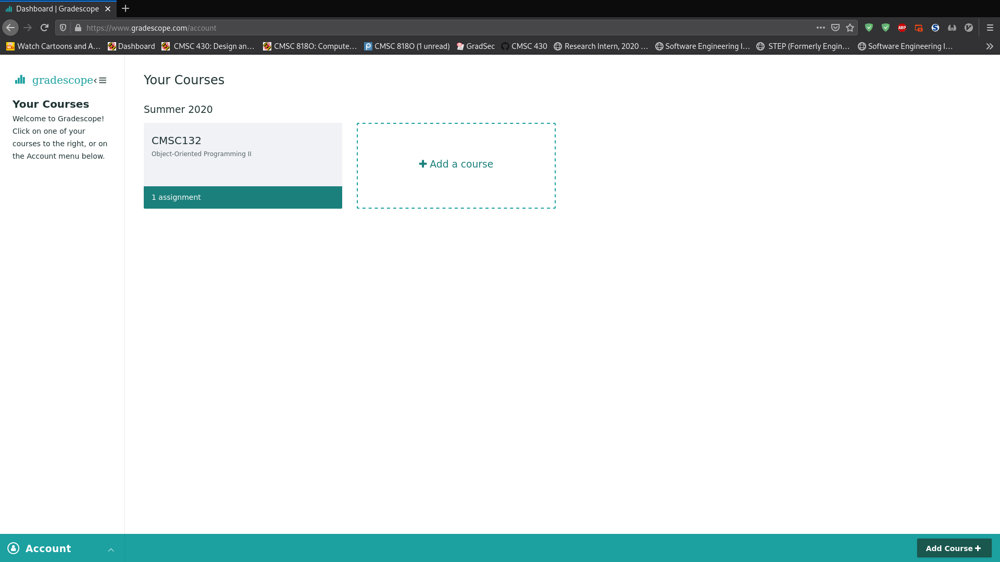
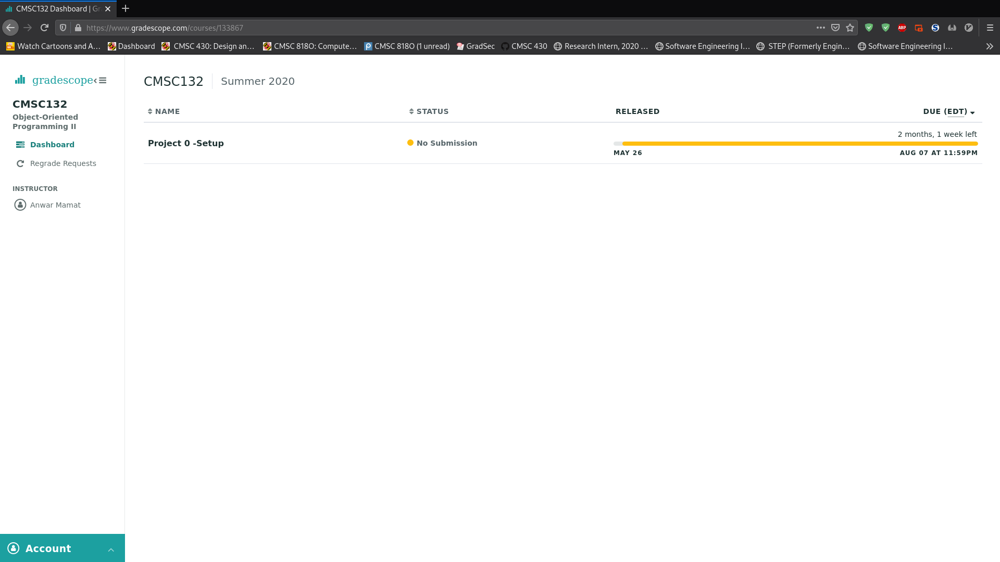
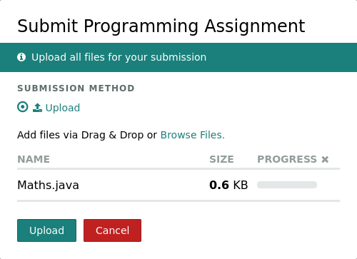

# Setting up Git in Eclipse Java

We are testing the use of git as a replacement for CVS for this class.  
Ideally, this should be an easier way to check out projects and discussion exercises.  
To set up your Eclipse environmenet for this purpose, follow the steps in this guide.

## Adding the Repository to Eclipse

The first thing we have to do is add the public repo to our Eclipse environment.  
First, open Eclipse, and go to Window > Show View > Other... > Git > Git Repositories, and click Open.  
A window called "Git Repositories" should show up somewhere in your IDE.

Click "Clone a Git repository" (or click this button: ), 
and enter "https://github.com/anwarmamat/cmsc132summer20" as the URI.  
The Host and Repository path boxes should be automatically filled out for you, but if not, just fill them out as shown in the next image.  
Set the protocol to http, and leave everything else blank.
Click Next, you should see one thing checked (master).  
If master is not already checked then please check it, and click Next again.  
Fill out the Directory box according to where you want the projects to be downloaded to.  
By default this will be some folder called "git", so you'll probably want to change it to be in your usual workspace (if it's not already).  
Importantly, this folder must either be empty or not exist, so add one directory after your workspace.  
For example, if my workspace is at `C:/Users/cliff/workspace`, I could put `C:/Users/cliff/workspace/cmsc132`, which would create a folder called `cmsc132` in my workspace.  
This can be called whatever you want.  Then UNcheck "Import all existing Eclipse projects after clone finishes", and then click Finish.

You should see the repository added in the "Git Repositories" pane in Eclipse.  
Expand it and then expand the "Working Tree".  
This is where the projects will be listed (in the following image there are no projects yet, we'll get to downloading projects next).

## Downloading New Projects

When a Project is released, you'll have to import it.  First, update the repository by right-clicking it and selecting "Pull".

You'll get a popup like this one, which you can safely close:

Then, you will see the new project loaded into the Working Tree:

## Importing New Projects

Right click the project (P0.Setup in this example) and click "Import Projects...".  
Simply click Finish in the popup window and the project will be imported into your Package Explorer.  

  

You should now be able to work on the project  

## Submitting Projects

When you are ready to submit a project, go to gradescope and click the 132 class.
Then click on the relevant assignment and submit the files which you modified.
Make sure the names of all the files needed are shown. 
Then, after you submit, the autograder will run. If everything compiled correctly, 
then you should get a score back from gradescope.

